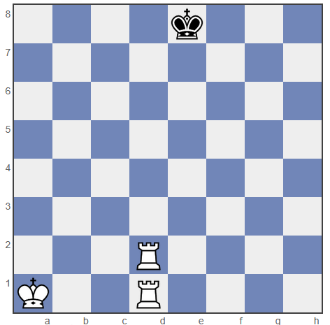
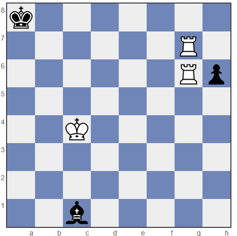

# Testausraportti
Testaus on toteutettu unittest kirjaston avulla. Testit ovat luokiteltuna omiin kategorioihin sijainnissa src/tests.\

Koodin laatua ylläpidetään pylintin avulla. pylint ja testit suoritetaan GitHubin actionsin avulla pilvessä automaattisesti, kun branchia päivitetään.

### moves_test.py
Testaa erilaisia liikkeitä laudalla, ja varmistaa, että nappulat liikkuvat, syövät ja mahdollisesti aiheuttaa shakin pelin sääntöjen mukaisesti.

Syötteet ovat kaikki siirtoja laudalla, jotka prosessoidaan normaalin pelin kulun mukaisesti ellei sitä tarkoituksella ohiteta vaihtamalla olevassa olevaa vuoroa. Kaikkien liikkeiden palautukset tarkistetaan.

**test_move_empty_square** - Yrittää liikuttaa tyhjän ruudun varattuun ruutuun.

**test_move_wrong_turn** - Liikuttaa väärällä vuorolla valkoisen, sekä mustan hevosen

**test_friendly_capture** - Yrittää syödä hevosella oman sotilaan

**test_all_pieces_move_once** - Liikuttaa kaikkia nappuloita ainakin kerran.

**test_pawn_move_and_capture** - Liikuttaa valkoisen, sekä mustan sotilaan kaksi askelta. Yrittää uudestaan, sen jälkeen syö mustan sotilaan valkoisella.

**test_fools_mate** - Testaa shakkimatin mahdollisimman nopeasti kuningattaren avulla.

**test_no_checkmate_at_start** - Tarkistaa, ettei ole shakkimattia alkutilanteessa

**test_initial_board_score** - Testaa laudan pisteytyksen alkutilanteessa.

**test_king_cannot_move_into_check** - Varmistaa, että kuningas ei voi liikkua shakkiin.

### ai_test.py
Testaa algoritmin toimintaa. Ideana on tarkistaa, että algoritmi löytää pakotettuja pelin lopetuksia monen siirron takaa.

Testeissä laudan tila alustetaan haluttuihin tilanteisiin, josta eteepäin algoritmin suositelmia parhaita siirtoja verrataan ennalta tiedettyihin parhaisiin siirtoihin.

**def test_ai_finds_mate_in_two** - Testaa, löytääkö algoritmi pakotetun shakin kahdella siirrolla.



**def test_ai_finds_mate_in_three** - Testaa, löytääkö algoritmi pakotetun shakin kolmella siirrolla.



### Kattavuusraportti
[](https://codecov.io/gh/mistablasta/mattishakki)

### Testien suorittaminen
Testit voi suorittaa paikallisesti projektin ympäristössä komennoilla
```
pytest src
```
```
pylint src
```